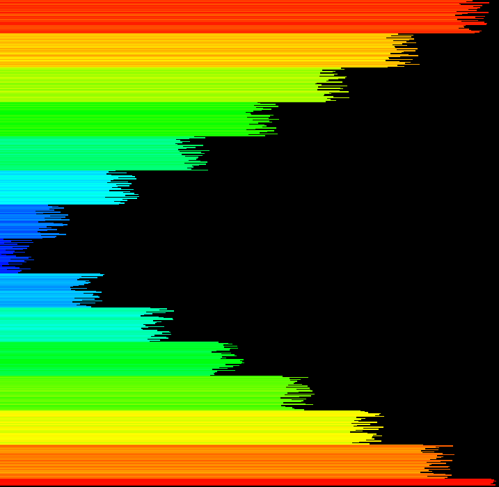

# 42_push_swap

### Small Description
  - This project is an introduction to sorting algorithms and the concepts of algorithm bounds (Big O, Omega and Theta).
  - We have two stacks at our disposal to use (stack A and stack B) and are only allowed to use a certain type of moves for the project, so most regular algorithms won't work.

### How the Algorithm Works
  - Start by normalizing the numbers, so we work from 1 to N numbers, intead of working with the original numbers we get
  - We initially divide every number in stack A by chunks
  - Then we push to B each chunks, from the smallest to biggest ones
  - After pushing to B, we check if that number, is in the upper half of the chunk it is in, or the lower half (one example, if our chunk is from number 1-20, the lower half would be 1-10, upper half 11-20)
  - If it's from the lower half, push B and rotate B (so it ends on bottom of B), if it's from the upper half we just push if to B.
  - Do that until only the three biggest numbers are on A.
  - When we finished pushing to B, we find the two biggest numbers in B, check the price to move them to A, move the smallest price.
  - Before pushing to A, check if the number is gonna be pushed to the correct place, if not, rotate A until it's in the right place, push A, reverse rotate util the smallest number is on top o A.
  - After pushing to A, check if (lst->num > lst->next->num), if so, swap A.
  - Keep doing that until only one number remains in B. Push the last number to the correct position.

### Best references
  - Thos references are the ones most helpful for my implementation of push swap. By any means they are the only ones available, and they will change drastically if you consider a different sorting algorithm, since they are for the type of algorithm I went for.
  - [youtube video by Fred 1000orion](https://www.youtube.com/watch?v=2aMrmWOgLvU)
  - [Medium Article by Jamie Dawson](https://medium.com/@jamierobertdawson/push-swap-the-least-amount-of-moves-with-two-stacks-d1e76a71789a)
  - [Medium Article by B.R.O.L.Y](https://medium.com/@ridwaneelfilali/push-swap-eff35d3ee0c4)
  - [github repo by okbrandon](https://github.com/okbrandon/push_swap)

### Visualizer
  - This visuallizer is pretty good if you want to have a visual representation of the algorithm
  - [visualizer](https://github.com/o-reo/push_swap_visualizer)

### Visual Representation of Stack B
  - Just one screenshot to show how stack B is after every number is pushed to it
  